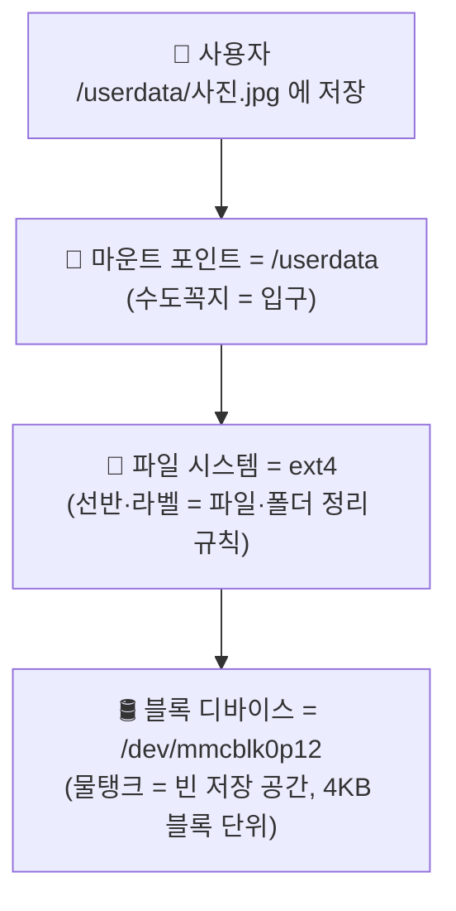
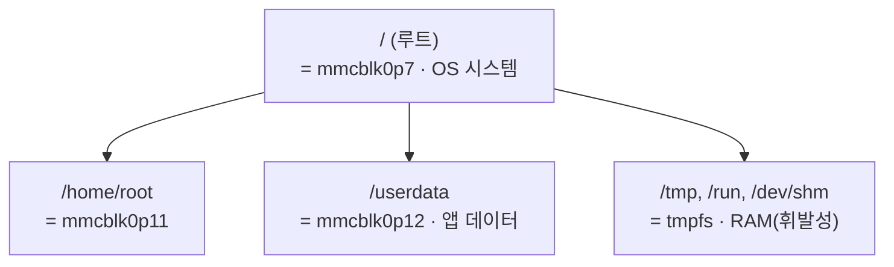

# CS 개념 정리 — 스토리지 / 메모리 / CPU / 리눅스

> CCU 부하테스트 작업 중 정리한 개념 노트 (2026-06)
> 다이어그램은 Mermaid — VS Code(확장)·GitHub·Obsidian에서 자동 렌더됨. 안 보이면 그 아래 ASCII 버전 참고.

## 목차
1. [큰 그림: 디스크(스토리지) vs 메모리(RAM)](#1-큰-그림-디스크스토리지-vs-메모리ram)
2. [🎨 직관: 물탱크–수도꼭지 비유 (블록디바이스·파일시스템·마운트)](#2--직관-물탱크수도꼭지-비유)
3. [CS 용어 정밀 정의 (레퍼런스)](#3-cs-용어-정밀-정의-레퍼런스)
4. [df / du](#4-df--du)
5. [CPU 사용률 — "100%"의 의미](#5-cpu-사용률--100의-의미)
6. [리눅스 명령어 모음](#6-리눅스-명령어-모음)
7. [부록: `df -h` 출력 읽는 법](#부록-df--h-출력-읽는-법)

---

## 1. 큰 그림: 디스크(스토리지) vs 메모리(RAM)

| | 스토리지(디스크) | 메모리(RAM) |
|---|---|---|
| 휘발성 | **비휘발성** — 전원 꺼도 유지 | **휘발성** — 전원 끄면 소멸 |
| 용도 | 파일·프로그램·데이터 **영구 보관** | 실행 중 프로그램의 **작업 공간** |
| 속도 | 느림 | 빠름 |
| 예 | eMMC, SSD, HDD | DRAM |

- **설치** = 디스크에 파일을 쌓는 것 / **실행** = 그걸 RAM에 올려 CPU로 돌리는 것.

---

## 2. 🎨 직관: 물탱크–수도꼭지 비유

세 개념(블록 디바이스 · 파일 시스템 · 마운트)은 **한 덩어리로 연결**돼 있어서 따로 보면 더 헷갈린다. **물탱크-수도꼭지** 하나로 끝까지 쌓아 올려 설명.

### 1단계: 블록 디바이스 = 물탱크 (그냥 큰 빈 통)
- eMMC·SSD 같은 저장 장치를 리눅스는 **블록 디바이스**라 부른다 = 데이터를 담는 **거대한 빈 통**. `/dev/mmcblk0p12` 같은 이름이 통 하나(파티션).
- 이 통 자체는 **질서 없는 빈 공간** — 0/1을 쭉 늘어놓을 수 있는 깡통. 어디에 뭘 넣었는지 찾을 방법은 아직 없음.
- "블록"인 이유: 데이터를 한 바이트씩이 아니라 **정해진 덩어리(블록, 예 4KB) 단위**로 넣고 뺀다. 이름은 그게 전부.

### 2단계: 파일 시스템 = 통 안에 설치한 선반·라벨 체계
- 빈 통에 막 부으면 못 찾는다. 그래서 "이 칸=무슨 파일, 이름·크기·생성시각" 을 기록·관리하는 체계를 깐다 = **파일 시스템**. (ext4, FAT 등이 그 종류)
- 정리:
  - **블록 디바이스(통)** = 데이터를 담을 물리적 공간
  - **파일 시스템(선반 체계)** = 그 공간을 "파일·폴더"로 정리하는 규칙
- **"파티션을 포맷한다"** = 빈 통에 이 선반 체계를 새로 설치. (그래서 포맷하면 내용이 다 날아감 — 선반을 싹 새로 짜니까)

### 3단계: 마운트 = 통에 수도꼭지 연결하기
- 리눅스는 모든 걸 **하나의 거대한 폴더 나무**로 표현. 맨 위가 `/`(루트), 그 아래 `/home`, `/userdata`, `/tmp` 가지들.
- 잘 정리된 통(파일 시스템)은 아직 이 나무 **바깥**에 있다. 이 통을 나무의 특정 가지에 **연결**하는 게 **마운트**.
- 수도꼭지 비유: 통에 `/userdata`라는 수도꼭지를 다는 것 = 마운트. 연결 후:
  1. 누군가 `/userdata/사진.jpg` 에 저장 →
  2. 그 수도꼭지를 통해 흘러서 →
  3. 실제로는 `mmcblk0p12` 통 안에 저장됨.
- 즉 `/userdata` 경로는 **통으로 들어가는 입구(수도꼭지)** 일 뿐, 실제 데이터는 통 안에. 이 `/userdata`를 **마운트 포인트**라 부름.

### 한 줄 흐름 (다이어그램)



ASCII 버전(렌더 안 될 때):
```
사용자:        /userdata/사진.jpg
                  │   (마운트 = 수도꼭지 연결)
                  ▼
파일 시스템:   ext4    (선반·라벨 = 파일/폴더 정리 규칙)
                  │
                  ▼
블록 디바이스: /dev/mmcblk0p12   (물탱크 = 빈 저장 공간)
```

### 왜 이렇게 번거롭게 만들었나
- 통이 여러 개여도(eMMC·USB·메모리…) 사용자는 **하나의 폴더 나무**만 보면 된다. `/userdata`에 가면 그게 eMMC인지 USB인지 신경 안 써도 됨 — 마운트가 뒤에서 처리.
- USB 꽂으면 `/media/usb` 폴더가 생기고(마운트), 빼면 사라짐(언마운트). **통을 연결/끊는 게 곧 마운트/언마운트**.

### 디렉터리 나무 + 마운트 (이 장비 예시)



→ `df` 표의 한 줄 = 이 **통-체계-입구 3종 세트**. (`Filesystem` 열 = 어느 통, `Mounted on` 열 = 어느 입구)

---

## 3. CS 용어 정밀 정의 (레퍼런스)

### 블록 디바이스 / eMMC
- **eMMC**(embedded MultiMediaCard): 임베디드 기기 내장 비휘발성 플래시 저장장치.
- **블록 디바이스**: 데이터를 고정 크기 **블록 단위**로 I/O 하는 저장장치 추상화. `/dev/` 아래 디바이스 노드로 노출.
- 네이밍: `/dev/mmcblk0` = 0번 eMMC 전체, `mmcblk0p7` = 그 디바이스의 7번 **파티션**. (`mmc`=eMMC, `blk`=block, `0`=장치번호, `pN`=파티션번호)

### 파티션 (partition) — 왜 쪼개나
하나의 물리 블록 디바이스를 **논리적으로 분할**한 구획(파티션 테이블 GPT/MBR에 기록).
1. **역할 분리** — 시스템(OS) vs 사용자 데이터.
2. **격리/내결함성** — 한 파티션이 full/corrupt 돼도 다른 파티션 보호.
3. **마운트 옵션·권한 차등** — 예: 시스템 read-only, 데이터 read-write.
4. **OTA/펌웨어 업데이트 독립성** — 시스템 이미지 갱신 시 데이터 보존.

### 파일 시스템 (filesystem)
파티션 위에 데이터를 **파일·디렉터리 구조**로 조직화하고 메타데이터(이름·크기·위치·권한·시각)·디렉터리 트리·블록 할당을 관리하는 포맷/방식. (ext4, F2FS, FAT… / 메모리 기반 tmpfs)

### 마운트 / 마운트 포인트
- **마운트** = 파일 시스템(파티션)을 디렉터리 트리의 한 지점에 **연결(attach)** 하는 동작.
- **마운트 포인트** = 연결되는 **디렉터리 경로**. 그 경로 이하 접근은 해당 파일 시스템으로 라우팅.
- ✅ 그래서 `/userdata` 같은 경로는 "폴더"이면서 동시에 "별도 파티션의 입구(마운트 포인트)"일 수 있음.

### 루트 파일 시스템 (`/`)
- 디렉터리 트리 최상위 `/`에 마운트된 파일 시스템. **OS 본체**(시스템 바이너리·라이브러리·설정)가 위치.
- 나머지(`/userdata`, `/home/root`…)는 루트 트리 하위에 마운트되어 하나로 합쳐짐.
- 루트가 full 되면 시스템이 쓰기 실패 → 서비스 비정상/부팅 불가 가능 (그래서 모니터링 대상).

### tmpfs / devtmpfs (메모리 기반 파일 시스템)
- **tmpfs**: 블록 디바이스 없이 **RAM(+swap)** 을 백엔드로 쓰는 **휘발성** fs. 재부팅/언마운트 시 소멸.
  - 용도: 임시 저장(`/tmp`,`/run`), 공유 메모리(`/dev/shm`), 플래시 **쓰기 마모 회피**, 휘발성 런타임 상태.
  - 크기는 상한만 지정, 실제 사용한 만큼만 RAM 점유.
- **devtmpfs**: 부팅 초기 커널이 `/dev`에 생성, 디바이스 노드(`/dev/...`)를 담는 tmpfs 계열.

---

## 4. df / du
- **df**(disk free): **마운트된 파일 시스템(파티션) 단위** 용량(전체/사용/가용).
- **du**(disk usage): **디렉터리/파일 경로**가 차지하는 실제 용량 합.

---

## 5. CPU 사용률 — "100%"의 의미

- **CPU 사용률(%) = 측정 구간 중 CPU가 idle 하지 않고 일한 시간의 비율.** ("얼마나 많이 계산했나"가 아니라 "얼마나 오래 점유했나".) 100% = idle 0 = 완전 포화.
- **시분할(time-slicing)**: 스케줄러가 CPU를 짧은 슬라이스로 나눠 여러 프로세스에 번갈아 할당 → 동시에 도는 것처럼 보임.
- **계산을 많이 해도 CPU%가 안 오르는 이유**: 작업이 주기당 한 번 잠깐 돌고 끝나면 나머지는 idle(sleep) → 사용률 낮음. *연산 횟수*가 아니라 *점유 시간 비율*이 CPU%를 정함.

```
1 tick = 1초
0ms │■■ 계산(수십 ms) ■■│·········· idle (나머지 ~950ms) ··········│ 1000ms
     → 잠깐 바쁘고 대부분 쉼 → 사용률(%)은 낮게 측정
```

- **포화 = "하드 한계"가 아니라 "성능 저하 지점"**: 요구량 > 처리량이면 계속 시분할로 나눠주되 **각자 몫이 줄어 느려짐**(latency↑). 프로세스가 못 도는 게 아니라 느리게 돔. (단 RAM/스레드 고갈은 하드 실패 — 종료/기동 불가.)
- **멀티코어 주의**: 지표가 전체 코어 합산 0~100%인지, 단일 코어 기준(100% 초과 가능)인지 정의 확인 필요.

---

## 6. 리눅스 명령어 모음

**접속/시스템**
| 명령 | 설명 |
|---|---|
| `ssh user@IP` | 원격 셸 접속 |
| `reboot` | 재부팅 |
| `nproc` | CPU 코어 수 |

**스토리지**
| 명령 | 설명 |
|---|---|
| `df -h` | 파일 시스템별 용량 (사람이 읽기 쉬운 단위) |
| `df -h <경로>` | 그 경로가 속한 파일 시스템만 |
| `du -sk <경로>` | 경로가 먹는 용량 (`-s` 합계, `-k` KB) |

**파일/텍스트**
| 명령 | 설명 |
|---|---|
| `cat <파일>` | 내용 전체 출력 |
| `tail <파일>` / `tail -F` | 끝부분 / 실시간 추적 |
| `ls -la` | 목록 (`-l` 상세, `-a` 숨김 포함) |
| `stat <파일>` | 파일 메타데이터(크기·시각·권한) |
| `find <경로> -name "x"` | 이름으로 검색 |
| `grep "단어" <파일>` | 단어 든 줄만 추출 |

**프로세스/메모리**
| 명령 | 설명 |
|---|---|
| `ps aux` | 실행 중 프로세스 목록 |
| `ps -o pid,rss,%cpu,comm -p <PID>` | 특정 프로세스 정보 |
| `free -m` | 메모리(RAM) 사용량(MB) |
| `kill <PID>` | 프로세스 종료 |

**파이프 `|`** — 앞 명령 출력을 뒤 명령 입력으로 넘김. 예: `grep METRIC log | tail -3`, `ps aux | grep app`.

**자주 쓰는 옵션**: `-h` human-readable / `-s` summary / `-a` all / `-l` long / `-r`·`-R` recursive

---

## 부록: `df -h` 출력 읽는 법

```
Filesystem        Size  Used Avail Use% Mounted on
/dev/mmcblk0p7    1.8G  1.2G  508M  71% /
tmpfs             1.7G   12K  1.7G   1% /tmp
/dev/mmcblk0p12   9.6G  1.7G  7.4G  19% /userdata
```

- **Filesystem 열 = 통(소스)의 정체**
  - `/dev/mmcblk0pN` → **진짜 플래시 파티션** (앞 `mmcblk0` 같으면 같은 칩, `pN`만 다르면 그 칩의 다른 파티션)
  - `tmpfs`/`devtmpfs` → **RAM 기반 가상 파일 시스템**
- **Mounted on 열 = 입구(마운트 포인트, 폴더 경로)**
- 위 예: `/`=OS(루트) 파티션, `/userdata`=앱 데이터 파티션(별도·더 큼), `/tmp`=RAM
- ⚠️ "디스크 용량" 볼 땐 **어느 마운트(파티션)** 인지 반드시 확인 — 같은 기기라도 `/` 와 `/userdata` 는 완전히 다른 저장 공간.
